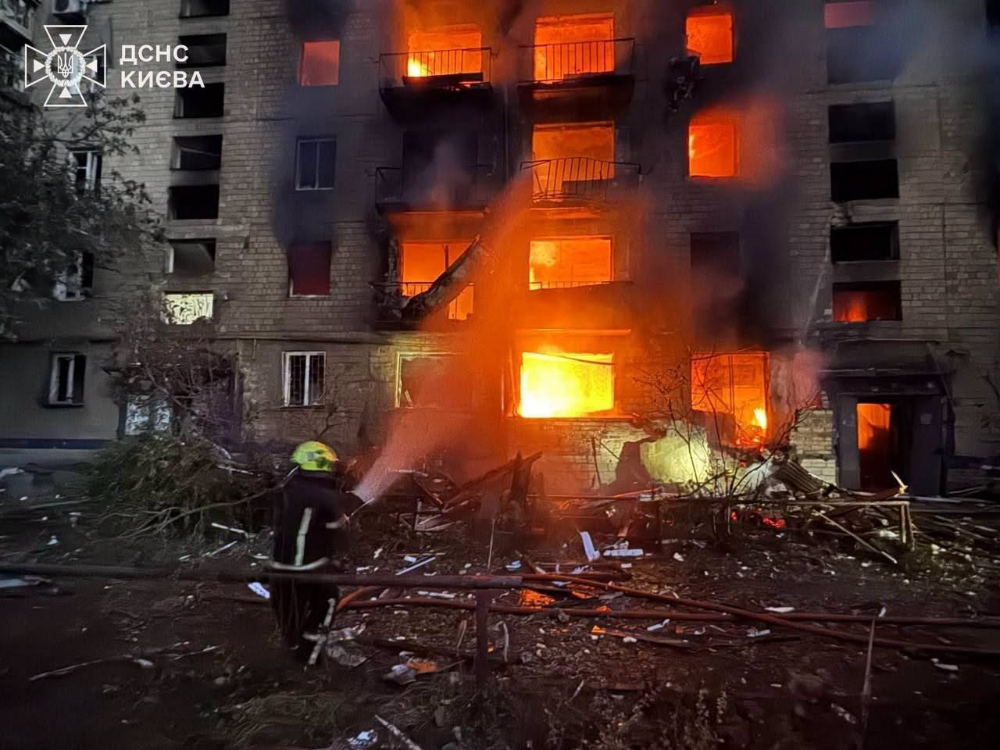

# Про проєкт

{ align=left width=220 style="margin-right: 20px; margin-bottom: 20px; border-radius: 8px;" }

Сайт створено на базі матеріалів авторського YouTube-каналу [«Михайло Висоцький: науково-популярні лекції»](https://www.youtube.com/@scientific_image) [Михайла Висоцького](../wiki/entities/mykhailo-vysotskyy.md), доцента Київського національного університету імені Тараса Шевченка про науковий образ світу, сучасну фізику та її філософські наслідки.

Цей ресурс є структурованою базою знань, яка систематизує лекційні та науково-популярні матеріали. Головна мета проєкту — сформувати цілісний, науково обґрунтований погляд на Всесвіт, природу матерії та місце людини у світі.

---

Проєкт побудовано з використанням автоматизованого агентського підходу за патерном [LLM Wiki](https://www.bogdanovych.org/blog/vid-rag-do-llm-wiki/).

Автор проєкту — [Андрій БОГДАНОВИЧ](https://www.bogdanovych.org/).

---

!!! danger "Трагічна подія та терміновий збір на допомогу"

    У ніч на **2 липня 2026 року** внаслідок чергового обстрілу з боку **російської федерації** постраждало житло двох викладачів КНУ ім. Тараса Шевченка: завідувача кафедри математики та теоретичної радіофізики Володимира Івановича Висоцького та його сина, доцента кафедри електрофізики Михайла Володимировича Висоцького.

    Дві їхні квартири у будинку біля кіностудії імені Олександра Довженка згоріли вщент — залишилися лише обгорілі стіни. За два тижні до цього вибуховою хвилею в помешканнях вибило всі вікна, а під час чергової нічної атаки квартири на 3-му та 4-му поверхах повністю вигоріли.

    На щастя, родина Висоцьких фізично не постраждала, наразі їм надано тимчасовий притулок. Проте вогонь знищив усе їхнє майно: особисті речі, комп'ютери, унікальні наукові рукописи, конспекти та книги.

    Михайло Висоцький описав наслідки трагедії так: *«Відновити дві квартири неможливо, не залишилось нічого, крім чорних стін. Нам немає де, за що і як жити. Втратили все, крім життя».*

    Детальніше про подію — у [першоджерелі на Facebook](https://www.facebook.com/photo?fbid=1583006880491024).

!!! success "Фінансова допомога"

    Ви можете допомогти родині Михайла та Володимира Висоцьких відновити життя і продовжити викладацьку та наукову діяльність. 👉 **[Банка для збору коштів на Monobank](https://send.monobank.ua/jar/2w4NsWTjJ1)**

{ width=100% style="display: block; margin: 20px 0; border-radius: 8px;" }
