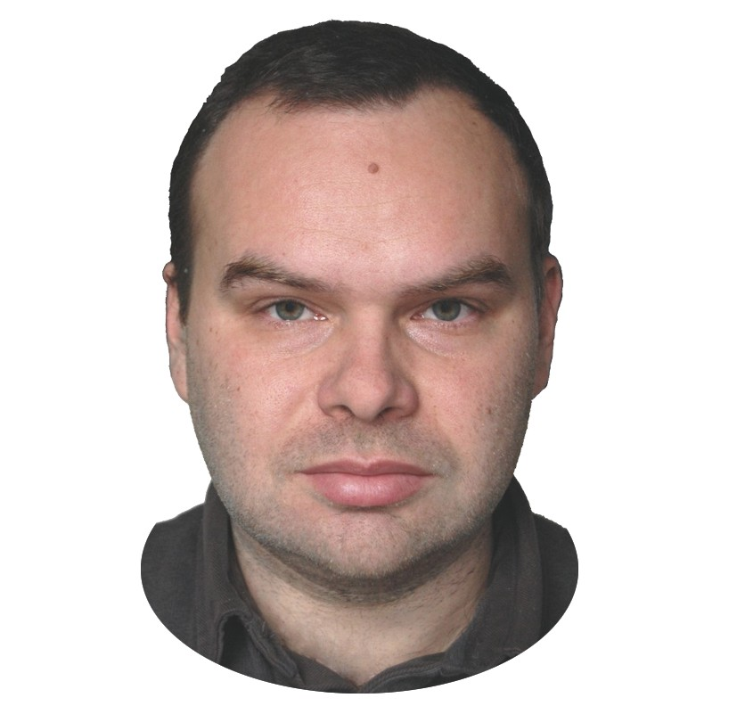

# Висоцький Михайло Володимирович

**1984 р.н., доцент**

Закінчив радіофізичний факультет Київського національного університету імені Тараса Шевченка в 2007 р. У 2011 р. захистив кандидатську дисертацію на тему “Особливості когерентних та нелінійних процесів при взаємодії рухомих заряджених та нейтральних частинок з упорядкованими середовищами” (науковий керівник проф. Анісімов І.О.) З 2010 р. працює асистентом кафедри електрофізики. Проводить семінарські заняття з різних курсів прикладної фізики та лабораторні заняття у механічному, коливальному, молекулярному, електричному та атомному практикумах. Основні напрями наукових досліджень: дослідження ефектів когерентності при каналюванні різних типів частинок, дослідження радіаційних та нелінійних процесів при каналюванні. Вперше побудована теорія повного ефекту Допплера у області критичних параметрів та на цій основі запропоновано різні схеми систем когерентного лазерного випромінювання у жорсткому діапазоні довжин хвиль, в тому числі схема тандемного лазера на рухомих частинках, в якому можливе випромінювання великої кількості фотонів при кожному з послідовних переходів в межах однієї пари рівнів з супутнім перетворення кінетичної енергії частинку в когерентне випромінювання. Також досліджено взаємодію холодних та ультрахолодних нейтронів з речовиною та передбачено існування позаядерного потенціального бар’єру та потенціальної ями, виникнення яких пов’язано з пондеромоторною взаємодією.

Опублікував близько 55 праць у міжнародних та вітчизняних наукових виданнях, в тому числі:

1. Vysotskii, V.I., Vysotskyy, M.V., Bartalucci, S. Application of Adaptive Channeling of Low-Energy Particles in Above-Target Graphene Film to Optimize Accelerator Nuclear Fusion in Unstructured Targets // Fusion Science and Technology, 2024
2. Vysotskii, V.I., Vysotskyy, M.V. Self-Controlled Flashing Nuclear Fusion in Stationary Magnetized Low-Temperature Plasma // Fusion Science and Technology, 2023, 79(5), pp. 537–552
3. Vysotskii, V.I., Rusov, V.D., Zelentsova, T.N., Vysotskyy, M.V., Smolyar, V.P. Correlation Method of 3-D Detection of Distant Sources of Gamma Radiation and Neutrinos by Intensity Interferometry // Nuclear Technology, 2023, 209(5), pp 716–729
4. Vysotskii, V.I., Vysotskyy, M.V. Fundamental prerequisites for realization of the quantum Zeno effect in the microwave and optical ranges // European Physical Journal D, 2022, 76(9), 158
5. Bartalucci, S., Vysotskii, V.I., Vysotskyy, M.V. A Search for Correlated Quantum States in Nuclear Reactions: First Exciting Results From an Experimental Test // Journal of Condensed Matter Nuclear Science, 2022, 36, pp. 130–136
6. Vysotskii, V.I., Vysotskyy, M.V., Bartalucci, S. LENR Solution of the Cosmological Lithium Problem // Journal of Condensed Matter Nuclear Science, 2022, 36, pp. 115–129
7. Vysotskii, V.I., Vysotskyy, M.V., Maksyuta, N.V. Channeling of Charged Particles Near the Surface of Semiconductors and Conducting Crystals // Journal of Surface Investigation, 2021, 15(2), pp. 302–308
8. Vysotskii, V.I., Vysotskyy, M.V., Kornilova, A.A. Hot laser fusion or low temperature nuclear reactions? Analysis and current prospects of the first experiments on laser fusion // Radioelektronika, Nanosistemy, Informacionnye Tehnologii, 2021, 13(1), pp. 59–70
